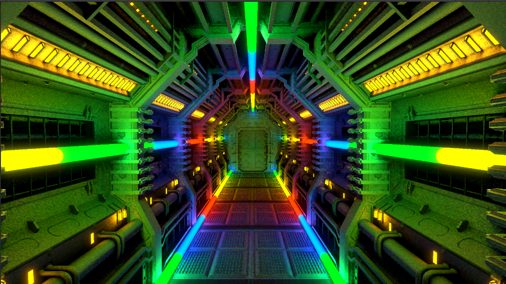

# Unity-SSRT-lighting-sample
Unity screen space raytraced lighting sample project

Plugins used:

SSRT: https://github.com/cdrinmatane/SSRT

KinoBloom:https://github.com/keijiro/KinoBloom

Corridoor model from 3dhdscan on Sketchfab: https://sketchfab.com/3d-models/sci-fi-corridor-5e6240c9b30145b0bf81fd02287985e3

